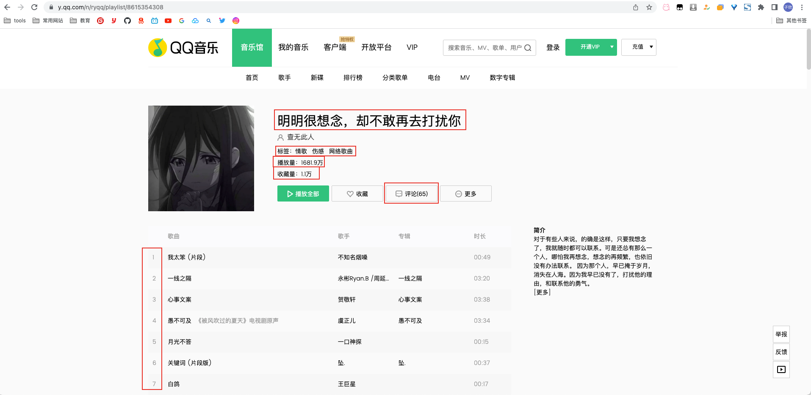
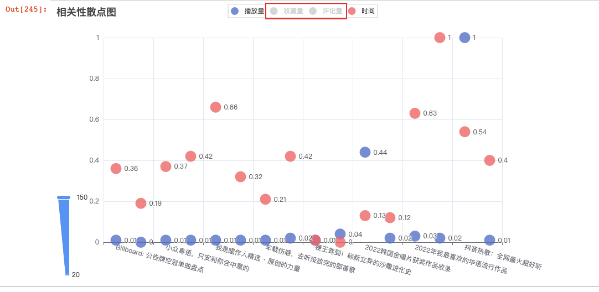
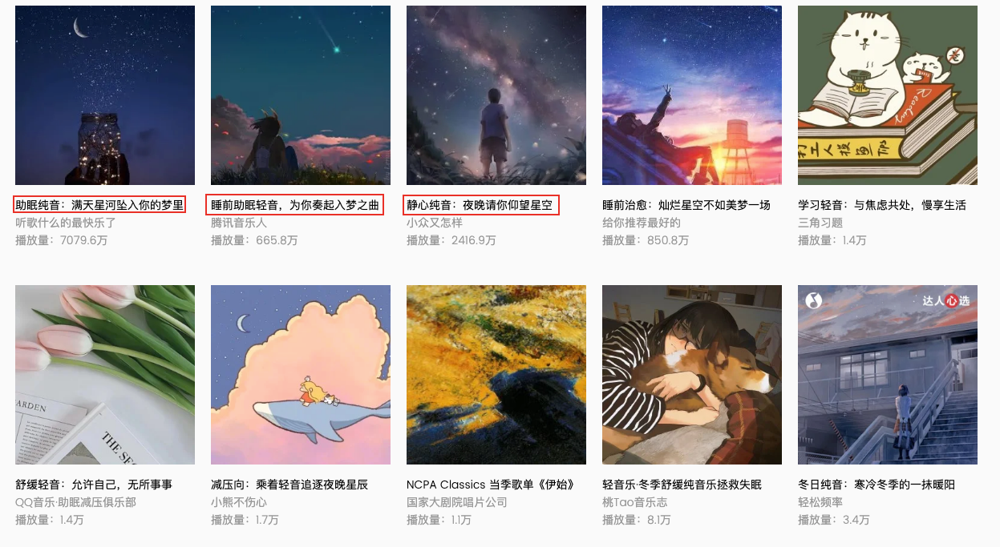
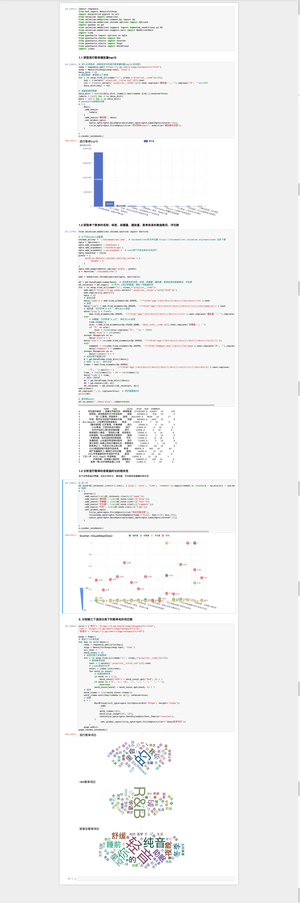

### 安装运行环境
```shell
pip install -i https://pypi.douban.com/simple/ -r requirements.txt
```
查看chrome版本，下载对应的chrome驱动，放在./plugins/下，下载地址：https://chromedriver.chromium.org/downloads

pyecharts图形显示也需要使用chrome

### 1.1 获取流行歌单播放量top10
requests爬取流行歌单下歌单名和播放量字段，通过pyecharts绘制柱状图


### 1.2 获取单个歌单的名称、标签、收藏量、播放量、歌单收录的歌曲数目、评论数
此处使用selenium爬取数据，需要根据chrome浏览器版本下载对应驱动放在./plugins/目录下，命名为"chromedriver.exe"。




### 1.3 分析流行歌单的各歌曲时长的相关性
对需要分析的字段进行归一化(min-max归一化)，使用pyecharts进行绘图。此处可隐藏部分显示，方便观察


### 2. 分别做三个流派分类下的歌单名的词云图
对三个分类歌单的标题进行爬取，然后使用jieba库进行分词，最后绘制成词云



### 运行结果
